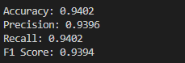

# LTSM+CNN进行安卓应用分类
- 代码模板参考：[CENTIME:A Direct Comprehensive Traffic Features Extraction for Encrypted Traffic Classification](https://github.com/lulu-cloud/Traffic-Classification)

## 1、原理
- 一维卷积处理负载数据，处理流前n个包的前m个字节
- Bi-LSTM处理包长序列，取流前seq_length的长度序列
- 模型结构类似于APP-Net

## 2、运行
- 在自己的环境下修改路径，包括删除``from sequence_payload.xx import xx``下面的``sequence_payload.``
- 修改配置文件``entry``下面的``traffic_classification.yaml``的路径，与模型参数，名字
###  
## 2.1 数据预处理
原理：
- 使用flowcontainer包提取含有tcp或者udp负载的包，提取负载与ip数据包序列长度 
使用：
- 将原始pcap文件放在``traffic_data``下
  - 格式:
  ~~~
	|---traffic_data
	  |---bilibili
      |--- xx.pcap
      |--- xxx.pcap
    |---qq
    |--- ...
  ~~~
  
  
- 运行``entry/preprocess.py``,完成后复制控制台输出的__label2index__,粘贴到``traffic_classification.yaml/test/traffic_classification.yaml``
- 得到处理好的  ``npy_data``
## 2.2 训练
- 打开``entry/train.py``，注释或者取消注释40、41、42行，选择cnn、lstm、cnn+lstm进行训练，记得改配置文件的``model_name``

- 可以打开tensorboard查看loss与acc曲线

  - loss:
    

  - acc:
    

    > 两图为lstm处理序列数据的tensorboard示例
## 2.3 测试
- 修改``traffic_classification.yaml/test/evaluate``为True，打开``entry/train.py``运行，得到评估结果
